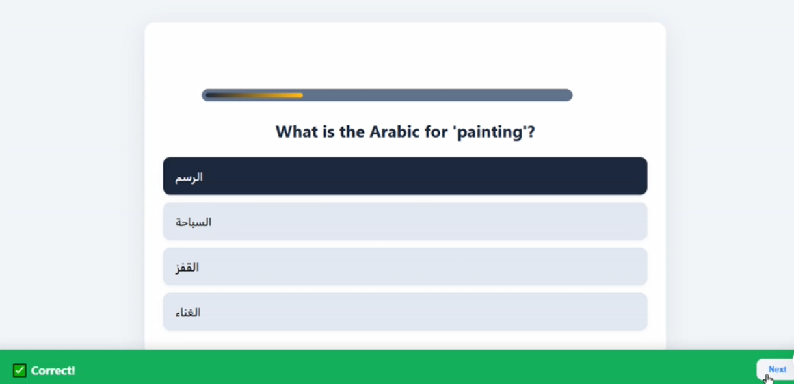

# 🐤 Duckie — AI-Powered English Language Learning Platform (Graduation Project)

  

Duckie is an AI-powered language learning platform designed to make mastering English engaging, interactive, and personalized. Through smart AI feedback, tailored learning paths, and immersive activities, Duckie helps learners improve their writing, speaking, listening, and reading skills confidently.

The platform combines a modern React frontend and a robust .NET backend API, ensuring a seamless and scalable experience for students, teachers, and content creators. While Duckie currently focuses on English, it is architected to support additional languages in the future.
---

## A system that helps you:
  * Learn the fundamentals of the language.
  * Practice writing, reading, and listening.
  * Receive real-time feedback.
  * Engage in various scenarios to learn how to speak correctly.
  * Interact with an AI agent that provides feedback on your language skills.
  * Join Virtual Learning Rooms to discuss topics with peers and receive assessments on your language proficiency, along with improvement suggestions.

---

## Who Can Use Duckie?
  ### Students
    * Learners aiming to improve their language skills.

  ### Content Providers
    * Organizations or individuals creating educational material.

  ### Teachers (Coaches)
    * Instructors providing guidance and feedback 

---

## 💻 Technologies Used

* **Frontend**: React web app + Flutter mobile app
* **Backend**: .NET (ASP.NET Core Web API)
* **AI Models**: Voice recognition, NLP analysis, chat model (Ollama)
* **Styling**: CSS Modules / Custom CSS
* **Database**: Microsoft SQL
* **Unit/Lesson Content**: Json files
* **Other**: JWT authentication, RESTful API design

---

## ⚙️ How to Run the Project

### Prerequisites

* Node.js and npm
* .NET 6.0 SDK (or later)

---

### Backend Setup

1. Navigate to the backend folder:

```bash
cd backend
```

2. Restore the dependencies:

```bash
dotnet restore
```

3. Apply any migrations (if using a database):

```bash
dotnet ef database update
```
---

### Frontend Setup

1. Navigate to the frontend folder:

```bash
cd react-frontend
```

2. Install dependencies:

```bash
npm install
```

3. Start the React development server:

```bash
npm start
```
The backend API will start at `https://localhost:5000` (or `http://localhost:5000`).
The app will be available at `http://localhost:3000`.
both will start together
---

## 🖼️ Screenshots

### Home Page
              

### Register Page
              

### Welcome Page
              

### Dashboard Page
              

### Quiz Page
              

### Chat Page
              

### Text Voice Model Page
              

### Lesson Page
             

### Payment Page
              
           
---

## 💼 Business Model

### 🧑‍🤝‍🧑 Customer Segments
- Students
- Beginners to intermediate English learners
- Individuals preparing for travel
- Users who prefer interactive, AI-driven learning
- English teachers
- Language experts / content creators
- Coaches (teachers)

### 💡 Value Propositions
#### For students
- Personalized learning paths tailored to their level and goals
- Interactive exercises with AI-powered feedback on pronunciation, grammar, and fluency
- Real-time conversation practice with AI and peers (speaking, writing, listening, comprehension)
- Gamified experience with progress tracking, badges, and rewards
- Affordable subscription plans

#### For content providers
- Platform to easily create and upload learning materials

#### For coaches
- Flexible teaching schedule
- Opportunity to connect with motivated students
- Tools to provide feedback and track student progress

### ❤️ Customer Relationships
- Personalized support via email or chat
- Community forums for peer interaction
- Progress reports and feedback

#### For content providers
- Support for English teachers, language experts, and creators of engaging learning materials

#### For coaches
- Certified English teachers
- Experienced language tutors
- Individuals seeking flexible teaching opportunities

### 📢 Channels
- Online: website and mobile app (when developed)
- Social media marketing
- Content marketing (e.g., blogs, tutorials)
- App Store optimization

### 🔑 Key Activities
- Content development and curation
- AI model training and improvement
- Platform development and maintenance
- Marketing and user acquisition
- Customer support
- Coach recruitment and management

### 🛠️ Key Resources
- AI technology (speech recognition, NLP)
- Learning content library
- Platform infrastructure (website, app)
- Team of developers, educators, and marketers
- Network of content providers and coaches

### 🤝 Key Partners
- Educational institutions
- Language testing organizations
- Content providers
- Technology partners (cloud services, etc.)

### 💰 Revenue Streams
#### From students
- Subscription fees for premium features (AI conversation, learning rooms, etc.)
- In-app purchases for additional content or coaching sessions

#### From content providers
- Percentage of revenue from course subscriptions
- Fees for storage or platform access

#### From coaches
- Percentage of fees from coaching sessions

### 💸 Cost Structure
- Technology infrastructure and development
- Content creation and licensing
- AI model training and maintenance
- Salaries and benefits
- Marketing and sales expenses
- Customer support costs

---

## 👥 Contributors

* **Eman Tamam**
  [LinkedIn](https://www.linkedin.com/in/eman-tamam-47a2a9241/) | [GitHub](https://github.com/Eman288)

* **Eman Mostafa**
  [LinkedIn](https://www.linkedin.com/in/eman-mostafa-29ab30240/) | [GitHub](https://github.com/contributor-github)

* **Ahmed Aziz**
  [LinkedIn](https://www.linkedin.com/in/ahmvd-aziz/) | [GitHub](https://github.com/Ahmvdaziz)

* **Abdellrahman Gaball**
  [LinkedIn](https://www.linkedin.com/in/abdelrahman-gaball/) | [GitHub](https://github.com/contributor-github)

---

## 📄 License

This project is open-source and available under the [MIT License](LICENSE).

---

## ⭐ Acknowledgements

Special thanks to everyone who contributed ideas, feedback, or support during the development of Duckie!

---

### ⭐ Don’t forget to star the repo if you find it useful!
